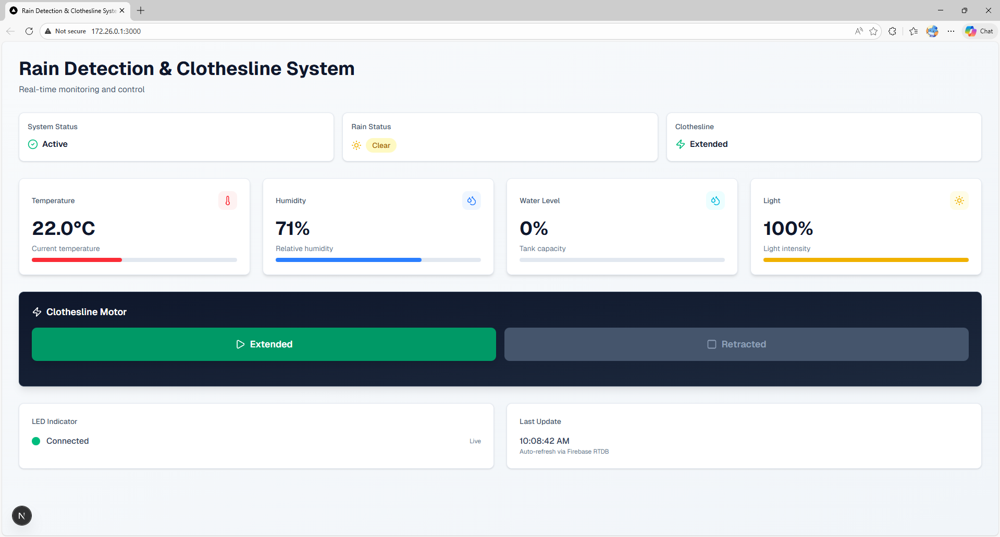
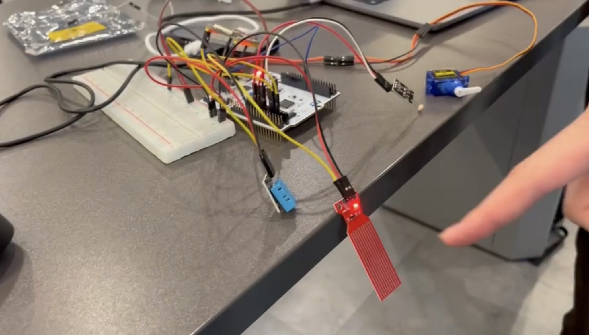

# 🌧️ Rain Detection & Prediction System

An embedded systems project focused on rain detection and prediction to automatically control a motorized clothes drying rack.
The system detects rainfall conditions and extends or retracts the rack automatically to protect clothes from rain, integrating both hardware control and a web-based monitoring interface.

Detailed system design, implementation, and logic are documented in `documentation.pdf` located in the project root directory.

## 📸 System Overview

Frontend Interface

Hardware & Circuit Integration

🧩 Project Components
- Rain detection & prediction logic
- Motor control for extended / retracted rack states
- Embedded hardware integration
- Web-based frontend for monitoring and interaction
